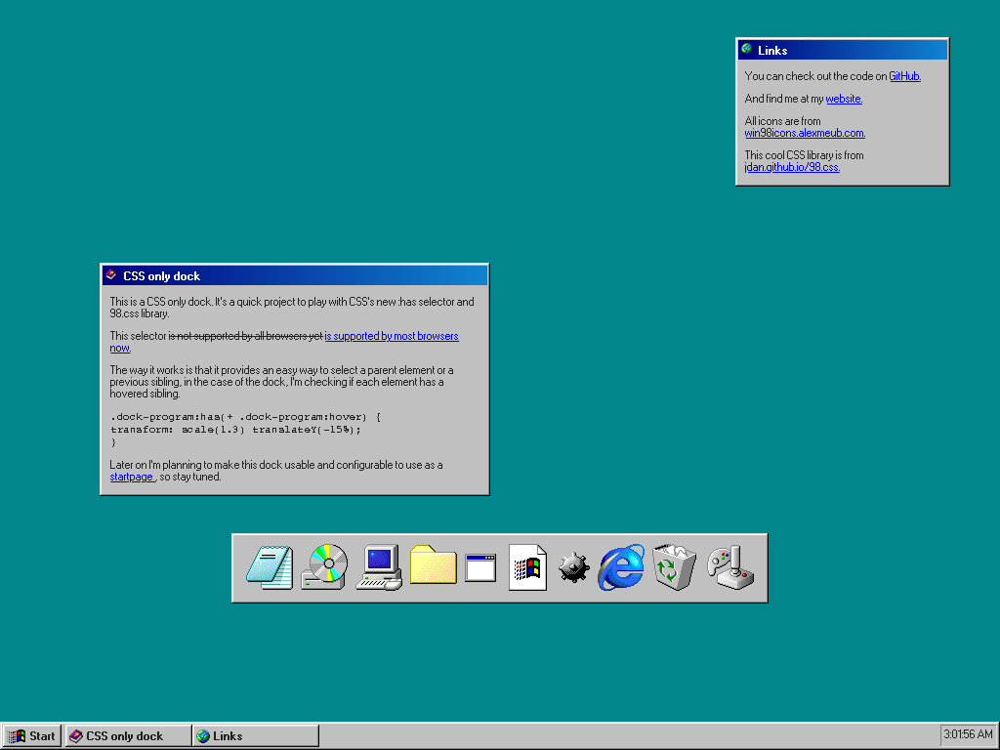

# CSS Dock

A CSS-only dock that utilizes the :has selector and 98.css library.

## Features

- nice icons
- bouncy animation
- customizable and configurable for various use cases

## Usage

To use or contribute to this project, follow these steps:

1. Clone the repository: `git clone https://github.com/andreymazepas/css-dock.git` or download it as a zip
2. Open `index.html` in a web browser or code editor of your choice
3. ???
4. profit

## Credits

- Icons sourced from [win98icons.alexmeub.com](https://win98icons.alexmeub.com/)
- CSS library: [98.css](https://jdan.github.io/98.css/)

## License

This project is licensed under the [MIT License](LICENSE).
